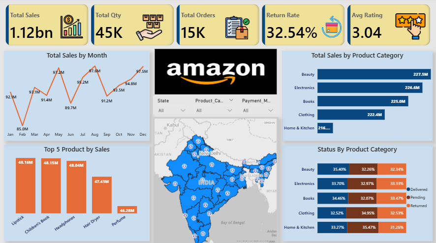

📊 Amazon India Sales Analysis (2025) – Power BI Dashboard

A full-year (12 months) e-commerce analytics dashboard built using Power BI, based on a synthetic dataset of 15,000 Amazon India transactions.
This project uncovers insights into customer behavior, product performance, payment trends, delivery patterns, and regional contributions.

🚀 Project Overview

This dashboard transforms raw transactional data into a clear, interactive view of Amazon India’s sales activity throughout January–December 2025.
It answers key business questions around revenue, category performance, seasonality, returns, and customer experience.

📌 Key Objectives

Analyze sales trends across 12 months

Identify best-performing product categories

Understand state-wise revenue contributions

Evaluate customer purchasing patterns

Study payment preferences (UPI, COD, Card, Wallet)

Measure delivery outcomes and return rates

Assess customer satisfaction using review ratings

🗂 Dataset Details

The dataset contains 15,000 e-commerce transactions with the following fields:

Order_ID – Unique transaction ID

Date – Order date

Customer_ID – Unique customer identifier

Product_Category – Electronics, Fashion, Beauty, etc.

Product_Name – Specific product purchased

Quantity – Units purchased

Unit_Price_INR – Price per unit

Total_Sales_INR – Quantity × Unit Price

Payment_Method – UPI, Card, COD, Wallet

Delivery_Status – Delivered, Returned, Pending

Review_Rating – Customer rating (1–5)

State – Delivery state in India

Country – Delivery country

(All data is synthetic and created for analysis practice.)

📊 Dashboard Features
🔹 1. KPI Section

Total Sales

Total Orders

Average Rating

Return Rate %

🔹 2. Sales Trend Analysis

Monthly and quarterly trends

Seasonal shopping patterns

🔹 3. Category-Level Insights

Best-selling categories

High-revenue segments

🔹 4. State-wise Sales Heatmap

Contribution of different Indian states

🔹 5. Payment Method Breakdown

UPI vs COD vs Card analysis

🔹 6. Delivery Status Overview

Return trends by category

Pending and delivered orders breakdown

🔹 7. Customer Experience

Average ratings by category/state

Review sentiment overview

🎯 Key Learnings

Building end-to-end dashboards

Designing meaningful visuals

Creating reusable DAX measures

Understanding e-commerce business metrics

Applying time intelligence in Power BI
